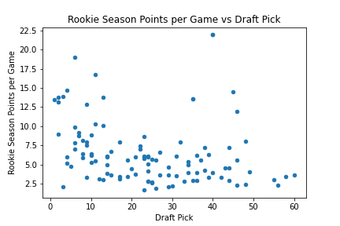

# EECS 731 - Project 1
### Author: Jace Kline

#### Industry: Professional Basketball (NBA)
#### Description:
The purpose of this project is to find and utilize different data sets from online sources to synthesize and produce a combined data set for future analysis and exploration. The learning goals for this project are as follows:
* Practice finding and obtaining online data sets
* Familiarize with the Python data science environment setup, including Anaconda, Jupyter Notebook, Pandas, and MatplotLib
* Learn the data science project structure
* Incorporate Git and GitHub for source control
* Practice documentation and representation of processes and ideas that are implemented in Jupyter Notebooks and code
* Familiarize with data cleaning, transformation, and visualization

In this project, we chose to include and examine two types of data:
1. NBA Draft picks from years 2012-2015 and the players' corresponding NBA Combine metrics
2. NBA Rookie year performance statistics

#### Goal:
In this project, our goal is to combine the above input data sources into a single Pandas DataFrame object, and we shall subsequently show a simple MatplotLib plot of a relationship within that combined data frame. We shall show the relationship of points per game versus draft pick for each player. To conlude, we will present some additional ideas for projects that could be carried out with our combined data set.

### Setup
In our procedure, we use the common data science libraries NumPy, Pandas, and MatplotLib. We must include these in our code.


```python
# Package import directives
import numpy as np
import pandas as pd
from matplotlib import pyplot as plt
%matplotlib inline
```


```python
# Specify relative data path constants
data_path = '../data/'
raw_data_path = data_path + 'raw/'
processed_data_path = data_path + 'processed/'
```

### Fetching Data from Data Sets
In this first section, we must read data from our data set files of type CSV and convert them into Pandas DataFrame objects.

#### NBA Draft and Combine Data Sets
In this first part, we grab each of the data set files of the draft/combine data and store them into a list of DataFrame objects. We then concatentate these frames together to produce a single data frame object.


```python
# Read NBA combine data sets from csv files for years 2012-2015
nba_combine_years = [2012, 2013, 2014, 2015]
nba_combine_paths = list(map(lambda x: raw_data_path + 'nba-combine-' + str(x) + '.csv', nba_combine_years))
nba_combine_frames = list(map(pd.read_csv, nba_combine_paths))

# Concatentate the NBA Combine stats into a single data frame and drop the redundant index column
nba_combine_stats = pd.concat(nba_combine_frames).drop(columns=['Unnamed: 0'])

# Show the columns of the combined data set
print('Columns: ', list(nba_combine_stats.columns))

# Show the first 10 data entries of the combined data set
nba_combine_stats.head(10)

# Evidence of successful imports + data combination below
```

    Columns:  ['Player', 'Year', 'Draft pick', 'Height (No Shoes)', 'Height (With Shoes)', 'Wingspan', 'Standing reach', 'Vertical (Max)', 'Vertical (Max Reach)', 'Vertical (No Step)', 'Vertical (No Step Reach)', 'Weight', 'Body Fat', 'Hand (Length)', 'Hand (Width)', 'Bench', 'Agility', 'Sprint']


<div>
<style scoped>
    .dataframe tbody tr th:only-of-type {
        vertical-align: middle;
    }

    .dataframe tbody tr th {
        vertical-align: top;
    }

    .dataframe thead th {
        text-align: right;
    }
</style>
<table border="1" class="dataframe">
  <thead>
    <tr style="text-align: right;">
      <th></th>
      <th>Player</th>
      <th>Year</th>
      <th>Draft pick</th>
      <th>Height (No Shoes)</th>
      <th>Height (With Shoes)</th>
      <th>Wingspan</th>
      <th>Standing reach</th>
      <th>Vertical (Max)</th>
      <th>Vertical (Max Reach)</th>
      <th>Vertical (No Step)</th>
      <th>Vertical (No Step Reach)</th>
      <th>Weight</th>
      <th>Body Fat</th>
      <th>Hand (Length)</th>
      <th>Hand (Width)</th>
      <th>Bench</th>
      <th>Agility</th>
      <th>Sprint</th>
    </tr>
  </thead>
  <tbody>
    <tr>
      <th>0</th>
      <td>Andre Drummond</td>
      <td>2012</td>
      <td>9.0</td>
      <td>81.75</td>
      <td>83.75</td>
      <td>90.25</td>
      <td>109.5</td>
      <td>33.5</td>
      <td>143.0</td>
      <td>31.5</td>
      <td>141.0</td>
      <td>279.0</td>
      <td>7.5</td>
      <td>9.50</td>
      <td>9.50</td>
      <td>10.0</td>
      <td>10.83</td>
      <td>3.39</td>
    </tr>
    <tr>
      <th>1</th>
      <td>Andrew Nicholson</td>
      <td>2012</td>
      <td>19.0</td>
      <td>80.50</td>
      <td>81.50</td>
      <td>88.00</td>
      <td>107.0</td>
      <td>30.5</td>
      <td>137.5</td>
      <td>28.5</td>
      <td>135.5</td>
      <td>234.0</td>
      <td>7.6</td>
      <td>10.00</td>
      <td>10.75</td>
      <td>10.0</td>
      <td>11.89</td>
      <td>3.67</td>
    </tr>
    <tr>
      <th>2</th>
      <td>Anthony Davis</td>
      <td>2012</td>
      <td>1.0</td>
      <td>81.25</td>
      <td>82.50</td>
      <td>89.50</td>
      <td>108.0</td>
      <td>NaN</td>
      <td>NaN</td>
      <td>NaN</td>
      <td>NaN</td>
      <td>222.0</td>
      <td>7.9</td>
      <td>9.00</td>
      <td>8.50</td>
      <td>NaN</td>
      <td>NaN</td>
      <td>NaN</td>
    </tr>
    <tr>
      <th>3</th>
      <td>Arnett Moultrie</td>
      <td>2012</td>
      <td>27.0</td>
      <td>81.50</td>
      <td>82.75</td>
      <td>86.25</td>
      <td>106.5</td>
      <td>37.5</td>
      <td>144.0</td>
      <td>33.5</td>
      <td>140.0</td>
      <td>233.0</td>
      <td>7.7</td>
      <td>9.25</td>
      <td>9.25</td>
      <td>10.0</td>
      <td>11.32</td>
      <td>3.22</td>
    </tr>
    <tr>
      <th>4</th>
      <td>Austin Rivers</td>
      <td>2012</td>
      <td>10.0</td>
      <td>75.50</td>
      <td>77.00</td>
      <td>79.25</td>
      <td>96.5</td>
      <td>37.5</td>
      <td>134.0</td>
      <td>32.5</td>
      <td>129.0</td>
      <td>203.0</td>
      <td>6.2</td>
      <td>8.50</td>
      <td>10.00</td>
      <td>1.0</td>
      <td>11.54</td>
      <td>3.32</td>
    </tr>
    <tr>
      <th>5</th>
      <td>Bernard James</td>
      <td>2012</td>
      <td>33.0</td>
      <td>80.75</td>
      <td>82.00</td>
      <td>87.00</td>
      <td>108.5</td>
      <td>32.5</td>
      <td>141.0</td>
      <td>30.0</td>
      <td>138.5</td>
      <td>230.0</td>
      <td>5.0</td>
      <td>9.00</td>
      <td>9.25</td>
      <td>6.0</td>
      <td>11.84</td>
      <td>3.40</td>
    </tr>
    <tr>
      <th>6</th>
      <td>Bradley Beal</td>
      <td>2012</td>
      <td>3.0</td>
      <td>75.25</td>
      <td>76.75</td>
      <td>80.00</td>
      <td>100.0</td>
      <td>39.0</td>
      <td>139.0</td>
      <td>33.0</td>
      <td>133.0</td>
      <td>202.0</td>
      <td>6.0</td>
      <td>8.50</td>
      <td>9.00</td>
      <td>8.0</td>
      <td>10.95</td>
      <td>3.28</td>
    </tr>
    <tr>
      <th>7</th>
      <td>Damian Lillard</td>
      <td>2012</td>
      <td>6.0</td>
      <td>73.75</td>
      <td>74.75</td>
      <td>79.75</td>
      <td>95.5</td>
      <td>39.5</td>
      <td>135.0</td>
      <td>34.5</td>
      <td>130.0</td>
      <td>189.0</td>
      <td>5.9</td>
      <td>8.75</td>
      <td>9.75</td>
      <td>13.0</td>
      <td>11.15</td>
      <td>3.34</td>
    </tr>
    <tr>
      <th>8</th>
      <td>Darius Johnson-Odom</td>
      <td>2012</td>
      <td>55.0</td>
      <td>73.50</td>
      <td>75.00</td>
      <td>79.00</td>
      <td>96.0</td>
      <td>41.5</td>
      <td>137.5</td>
      <td>33.5</td>
      <td>129.5</td>
      <td>212.0</td>
      <td>7.0</td>
      <td>8.75</td>
      <td>8.75</td>
      <td>17.0</td>
      <td>10.76</td>
      <td>3.21</td>
    </tr>
    <tr>
      <th>9</th>
      <td>Darius Miller</td>
      <td>2012</td>
      <td>46.0</td>
      <td>78.00</td>
      <td>79.50</td>
      <td>81.00</td>
      <td>101.0</td>
      <td>37.0</td>
      <td>138.0</td>
      <td>33.0</td>
      <td>134.0</td>
      <td>233.0</td>
      <td>7.5</td>
      <td>8.50</td>
      <td>8.75</td>
      <td>14.0</td>
      <td>11.34</td>
      <td>3.31</td>
    </tr>
  </tbody>
</table>
</div>


#### NBA Rookie Year Stats Data Set
Following the load and combination of the previous data sets, we now shall load the data set that lists the statistics of NBA players in their rookie year. We use a similar procedure as above to load and display the data.


```python
# Read NBA Rookie year stats from csv file

# Import the data and remove the target 5 year prediction
nba_rookie_stats = pd.read_csv(raw_data_path + 'nba-rookie-stats.csv').drop(columns=['TARGET_5Yrs'])

# Rename the 'Name' column to 'Player' to make it consistent with the other data set
nba_rookie_stats.rename(columns={"Name": "Player"}, inplace=True)

# Show the columns
print('Columns: ', list(nba_rookie_stats.columns))

# Print the first 10 entries in the data frame
nba_rookie_stats.head(10)

# Evidence of successful data import below
```

    Columns:  ['Player', 'GP', 'MIN', 'PTS', 'FGM', 'FGA', 'FG%', '3P Made', '3PA', '3P%', 'FTM', 'FTA', 'FT%', 'OREB', 'DREB', 'REB', 'AST', 'STL', 'BLK', 'TOV']


<div>
<style scoped>
    .dataframe tbody tr th:only-of-type {
        vertical-align: middle;
    }

    .dataframe tbody tr th {
        vertical-align: top;
    }

    .dataframe thead th {
        text-align: right;
    }
</style>
<table border="1" class="dataframe">
  <thead>
    <tr style="text-align: right;">
      <th></th>
      <th>Player</th>
      <th>GP</th>
      <th>MIN</th>
      <th>PTS</th>
      <th>FGM</th>
      <th>FGA</th>
      <th>FG%</th>
      <th>3P Made</th>
      <th>3PA</th>
      <th>3P%</th>
      <th>FTM</th>
      <th>FTA</th>
      <th>FT%</th>
      <th>OREB</th>
      <th>DREB</th>
      <th>REB</th>
      <th>AST</th>
      <th>STL</th>
      <th>BLK</th>
      <th>TOV</th>
    </tr>
  </thead>
  <tbody>
    <tr>
      <th>0</th>
      <td>Brandon Ingram</td>
      <td>36</td>
      <td>27.4</td>
      <td>7.4</td>
      <td>2.6</td>
      <td>7.6</td>
      <td>34.7</td>
      <td>0.5</td>
      <td>2.1</td>
      <td>25.0</td>
      <td>1.6</td>
      <td>2.3</td>
      <td>69.9</td>
      <td>0.7</td>
      <td>3.4</td>
      <td>4.1</td>
      <td>1.9</td>
      <td>0.4</td>
      <td>0.4</td>
      <td>1.3</td>
    </tr>
    <tr>
      <th>1</th>
      <td>Andrew Harrison</td>
      <td>35</td>
      <td>26.9</td>
      <td>7.2</td>
      <td>2.0</td>
      <td>6.7</td>
      <td>29.6</td>
      <td>0.7</td>
      <td>2.8</td>
      <td>23.5</td>
      <td>2.6</td>
      <td>3.4</td>
      <td>76.5</td>
      <td>0.5</td>
      <td>2.0</td>
      <td>2.4</td>
      <td>3.7</td>
      <td>1.1</td>
      <td>0.5</td>
      <td>1.6</td>
    </tr>
    <tr>
      <th>2</th>
      <td>JaKarr Sampson</td>
      <td>74</td>
      <td>15.3</td>
      <td>5.2</td>
      <td>2.0</td>
      <td>4.7</td>
      <td>42.2</td>
      <td>0.4</td>
      <td>1.7</td>
      <td>24.4</td>
      <td>0.9</td>
      <td>1.3</td>
      <td>67.0</td>
      <td>0.5</td>
      <td>1.7</td>
      <td>2.2</td>
      <td>1.0</td>
      <td>0.5</td>
      <td>0.3</td>
      <td>1.0</td>
    </tr>
    <tr>
      <th>3</th>
      <td>Malik Sealy</td>
      <td>58</td>
      <td>11.6</td>
      <td>5.7</td>
      <td>2.3</td>
      <td>5.5</td>
      <td>42.6</td>
      <td>0.1</td>
      <td>0.5</td>
      <td>22.6</td>
      <td>0.9</td>
      <td>1.3</td>
      <td>68.9</td>
      <td>1.0</td>
      <td>0.9</td>
      <td>1.9</td>
      <td>0.8</td>
      <td>0.6</td>
      <td>0.1</td>
      <td>1.0</td>
    </tr>
    <tr>
      <th>4</th>
      <td>Matt Geiger</td>
      <td>48</td>
      <td>11.5</td>
      <td>4.5</td>
      <td>1.6</td>
      <td>3.0</td>
      <td>52.4</td>
      <td>0.0</td>
      <td>0.1</td>
      <td>0.0</td>
      <td>1.3</td>
      <td>1.9</td>
      <td>67.4</td>
      <td>1.0</td>
      <td>1.5</td>
      <td>2.5</td>
      <td>0.3</td>
      <td>0.3</td>
      <td>0.4</td>
      <td>0.8</td>
    </tr>
    <tr>
      <th>5</th>
      <td>Tony Bennett</td>
      <td>75</td>
      <td>11.4</td>
      <td>3.7</td>
      <td>1.5</td>
      <td>3.5</td>
      <td>42.3</td>
      <td>0.3</td>
      <td>1.1</td>
      <td>32.5</td>
      <td>0.4</td>
      <td>0.5</td>
      <td>73.2</td>
      <td>0.2</td>
      <td>0.7</td>
      <td>0.8</td>
      <td>1.8</td>
      <td>0.4</td>
      <td>0.0</td>
      <td>0.7</td>
    </tr>
    <tr>
      <th>6</th>
      <td>Don MacLean</td>
      <td>62</td>
      <td>10.9</td>
      <td>6.6</td>
      <td>2.5</td>
      <td>5.8</td>
      <td>43.5</td>
      <td>0.0</td>
      <td>0.1</td>
      <td>50.0</td>
      <td>1.5</td>
      <td>1.8</td>
      <td>81.1</td>
      <td>0.5</td>
      <td>1.4</td>
      <td>2.0</td>
      <td>0.6</td>
      <td>0.2</td>
      <td>0.1</td>
      <td>0.7</td>
    </tr>
    <tr>
      <th>7</th>
      <td>Tracy Murray</td>
      <td>48</td>
      <td>10.3</td>
      <td>5.7</td>
      <td>2.3</td>
      <td>5.4</td>
      <td>41.5</td>
      <td>0.4</td>
      <td>1.5</td>
      <td>30.0</td>
      <td>0.7</td>
      <td>0.8</td>
      <td>87.5</td>
      <td>0.8</td>
      <td>0.9</td>
      <td>1.7</td>
      <td>0.2</td>
      <td>0.2</td>
      <td>0.1</td>
      <td>0.7</td>
    </tr>
    <tr>
      <th>8</th>
      <td>Duane Cooper</td>
      <td>65</td>
      <td>9.9</td>
      <td>2.4</td>
      <td>1.0</td>
      <td>2.4</td>
      <td>39.2</td>
      <td>0.1</td>
      <td>0.5</td>
      <td>23.3</td>
      <td>0.4</td>
      <td>0.5</td>
      <td>71.4</td>
      <td>0.2</td>
      <td>0.6</td>
      <td>0.8</td>
      <td>2.3</td>
      <td>0.3</td>
      <td>0.0</td>
      <td>1.1</td>
    </tr>
    <tr>
      <th>9</th>
      <td>Dave Johnson</td>
      <td>42</td>
      <td>8.5</td>
      <td>3.7</td>
      <td>1.4</td>
      <td>3.5</td>
      <td>38.3</td>
      <td>0.1</td>
      <td>0.3</td>
      <td>21.4</td>
      <td>1.0</td>
      <td>1.4</td>
      <td>67.8</td>
      <td>0.4</td>
      <td>0.7</td>
      <td>1.1</td>
      <td>0.3</td>
      <td>0.2</td>
      <td>0.0</td>
      <td>0.7</td>
    </tr>
  </tbody>
</table>
</div>


### Combining Data Sets
After loading our data sets, we shall combine the data sets into a single data set using the merge() function provided by Pandas. Since the 'Player' column is the only shared column between the two input data sets, we do not have to specify additional parameters to achieve our desired behavior. After this merge action is executed, we write an initial version of the data set to a file within the 'data/processed' directory.


```python
# Let's find all the players from the rookie stats data set that are also present in the NBA Combine + draft data set
# We shall create a new data frame for this filtered set

# We use an inner join merge operation to combine the data sets on the 'Player' column
merged_initial = pd.merge(nba_combine_stats, nba_rookie_stats)

# Write the combined data set to the 'data/processed' path
merged_initial.to_csv(processed_data_path + 'merged-initial.csv')

# Print the combined data set
merged_initial
```


<div>
<style scoped>
    .dataframe tbody tr th:only-of-type {
        vertical-align: middle;
    }

    .dataframe tbody tr th {
        vertical-align: top;
    }

    .dataframe thead th {
        text-align: right;
    }
</style>
<table border="1" class="dataframe">
  <thead>
    <tr style="text-align: right;">
      <th></th>
      <th>Player</th>
      <th>Year</th>
      <th>Draft pick</th>
      <th>Height (No Shoes)</th>
      <th>Height (With Shoes)</th>
      <th>Wingspan</th>
      <th>Standing reach</th>
      <th>Vertical (Max)</th>
      <th>Vertical (Max Reach)</th>
      <th>Vertical (No Step)</th>
      <th>...</th>
      <th>FTM</th>
      <th>FTA</th>
      <th>FT%</th>
      <th>OREB</th>
      <th>DREB</th>
      <th>REB</th>
      <th>AST</th>
      <th>STL</th>
      <th>BLK</th>
      <th>TOV</th>
    </tr>
  </thead>
  <tbody>
    <tr>
      <th>0</th>
      <td>Andre Drummond</td>
      <td>2012</td>
      <td>9.0</td>
      <td>81.75</td>
      <td>83.75</td>
      <td>90.25</td>
      <td>109.5</td>
      <td>33.5</td>
      <td>143.0</td>
      <td>31.5</td>
      <td>...</td>
      <td>1.0</td>
      <td>2.7</td>
      <td>37.1</td>
      <td>2.8</td>
      <td>4.8</td>
      <td>7.6</td>
      <td>0.5</td>
      <td>1.0</td>
      <td>1.6</td>
      <td>0.9</td>
    </tr>
    <tr>
      <th>1</th>
      <td>Anthony Davis</td>
      <td>2012</td>
      <td>1.0</td>
      <td>81.25</td>
      <td>82.50</td>
      <td>89.50</td>
      <td>108.0</td>
      <td>NaN</td>
      <td>NaN</td>
      <td>NaN</td>
      <td>...</td>
      <td>2.6</td>
      <td>3.5</td>
      <td>75.1</td>
      <td>2.6</td>
      <td>5.6</td>
      <td>8.2</td>
      <td>1.0</td>
      <td>1.2</td>
      <td>1.8</td>
      <td>1.4</td>
    </tr>
    <tr>
      <th>2</th>
      <td>Arnett Moultrie</td>
      <td>2012</td>
      <td>27.0</td>
      <td>81.50</td>
      <td>82.75</td>
      <td>86.25</td>
      <td>106.5</td>
      <td>37.5</td>
      <td>144.0</td>
      <td>33.5</td>
      <td>...</td>
      <td>0.4</td>
      <td>0.6</td>
      <td>64.3</td>
      <td>1.6</td>
      <td>1.5</td>
      <td>3.1</td>
      <td>0.2</td>
      <td>0.4</td>
      <td>0.2</td>
      <td>0.4</td>
    </tr>
    <tr>
      <th>3</th>
      <td>Austin Rivers</td>
      <td>2012</td>
      <td>10.0</td>
      <td>75.50</td>
      <td>77.00</td>
      <td>79.25</td>
      <td>96.5</td>
      <td>37.5</td>
      <td>134.0</td>
      <td>32.5</td>
      <td>...</td>
      <td>1.0</td>
      <td>1.8</td>
      <td>54.6</td>
      <td>0.3</td>
      <td>1.5</td>
      <td>1.8</td>
      <td>2.1</td>
      <td>0.4</td>
      <td>0.1</td>
      <td>1.2</td>
    </tr>
    <tr>
      <th>4</th>
      <td>Bernard James</td>
      <td>2012</td>
      <td>33.0</td>
      <td>80.75</td>
      <td>82.00</td>
      <td>87.00</td>
      <td>108.5</td>
      <td>32.5</td>
      <td>141.0</td>
      <td>30.0</td>
      <td>...</td>
      <td>0.5</td>
      <td>0.9</td>
      <td>61.0</td>
      <td>1.1</td>
      <td>1.7</td>
      <td>2.8</td>
      <td>0.1</td>
      <td>0.3</td>
      <td>0.8</td>
      <td>0.4</td>
    </tr>
    <tr>
      <th>...</th>
      <td>...</td>
      <td>...</td>
      <td>...</td>
      <td>...</td>
      <td>...</td>
      <td>...</td>
      <td>...</td>
      <td>...</td>
      <td>...</td>
      <td>...</td>
      <td>...</td>
      <td>...</td>
      <td>...</td>
      <td>...</td>
      <td>...</td>
      <td>...</td>
      <td>...</td>
      <td>...</td>
      <td>...</td>
      <td>...</td>
      <td>...</td>
    </tr>
    <tr>
      <th>103</th>
      <td>Rondae Hollis-Jefferson</td>
      <td>2015</td>
      <td>23.0</td>
      <td>77.50</td>
      <td>79.00</td>
      <td>86.00</td>
      <td>104.0</td>
      <td>38.0</td>
      <td>142.0</td>
      <td>32.0</td>
      <td>...</td>
      <td>1.3</td>
      <td>1.8</td>
      <td>71.2</td>
      <td>1.3</td>
      <td>4.0</td>
      <td>5.3</td>
      <td>1.5</td>
      <td>1.3</td>
      <td>0.6</td>
      <td>0.9</td>
    </tr>
    <tr>
      <th>104</th>
      <td>Stanley Johnson</td>
      <td>2015</td>
      <td>8.0</td>
      <td>77.00</td>
      <td>78.50</td>
      <td>83.50</td>
      <td>102.0</td>
      <td>NaN</td>
      <td>NaN</td>
      <td>NaN</td>
      <td>...</td>
      <td>1.1</td>
      <td>1.4</td>
      <td>78.4</td>
      <td>0.8</td>
      <td>3.4</td>
      <td>4.2</td>
      <td>1.6</td>
      <td>0.8</td>
      <td>0.2</td>
      <td>1.6</td>
    </tr>
    <tr>
      <th>105</th>
      <td>T.J. McConnell</td>
      <td>2015</td>
      <td>NaN</td>
      <td>72.50</td>
      <td>74.00</td>
      <td>74.00</td>
      <td>96.5</td>
      <td>31.5</td>
      <td>128.0</td>
      <td>26.0</td>
      <td>...</td>
      <td>0.3</td>
      <td>0.5</td>
      <td>63.4</td>
      <td>0.5</td>
      <td>2.6</td>
      <td>3.1</td>
      <td>4.5</td>
      <td>1.2</td>
      <td>0.1</td>
      <td>1.7</td>
    </tr>
    <tr>
      <th>106</th>
      <td>Tyus Jones</td>
      <td>2015</td>
      <td>24.0</td>
      <td>72.25</td>
      <td>74.00</td>
      <td>77.00</td>
      <td>97.0</td>
      <td>32.5</td>
      <td>129.5</td>
      <td>26.5</td>
      <td>...</td>
      <td>0.8</td>
      <td>1.1</td>
      <td>71.8</td>
      <td>0.2</td>
      <td>1.1</td>
      <td>1.3</td>
      <td>2.9</td>
      <td>0.8</td>
      <td>0.1</td>
      <td>0.9</td>
    </tr>
    <tr>
      <th>107</th>
      <td>Willie Cauley-Stein</td>
      <td>2015</td>
      <td>6.0</td>
      <td>83.25</td>
      <td>84.50</td>
      <td>87.00</td>
      <td>111.0</td>
      <td>NaN</td>
      <td>NaN</td>
      <td>NaN</td>
      <td>...</td>
      <td>1.2</td>
      <td>1.9</td>
      <td>64.8</td>
      <td>2.0</td>
      <td>3.3</td>
      <td>5.3</td>
      <td>0.6</td>
      <td>0.7</td>
      <td>1.0</td>
      <td>0.7</td>
    </tr>
  </tbody>
</table>
<p>108 rows × 37 columns</p>
</div>


### Statistical Descriptors
After we combined the two data frames into a single merged data frame, we use the Pandas describe() function to generate a frame that describes common statistical measures for the combined data. We shall use these values in the next section when we proceed to clean the data.


```python
# Obtain the high-level statistical description of the merged data set
stats_initial = merged_initial.describe()

# Print statistics
stats_initial
```


<div>
<style scoped>
    .dataframe tbody tr th:only-of-type {
        vertical-align: middle;
    }

    .dataframe tbody tr th {
        vertical-align: top;
    }

    .dataframe thead th {
        text-align: right;
    }
</style>
<table border="1" class="dataframe">
  <thead>
    <tr style="text-align: right;">
      <th></th>
      <th>Year</th>
      <th>Draft pick</th>
      <th>Height (No Shoes)</th>
      <th>Height (With Shoes)</th>
      <th>Wingspan</th>
      <th>Standing reach</th>
      <th>Vertical (Max)</th>
      <th>Vertical (Max Reach)</th>
      <th>Vertical (No Step)</th>
      <th>Vertical (No Step Reach)</th>
      <th>...</th>
      <th>FTM</th>
      <th>FTA</th>
      <th>FT%</th>
      <th>OREB</th>
      <th>DREB</th>
      <th>REB</th>
      <th>AST</th>
      <th>STL</th>
      <th>BLK</th>
      <th>TOV</th>
    </tr>
  </thead>
  <tbody>
    <tr>
      <th>count</th>
      <td>108.000000</td>
      <td>104.000000</td>
      <td>108.000000</td>
      <td>108.000000</td>
      <td>108.000000</td>
      <td>108.000000</td>
      <td>90.000000</td>
      <td>90.000000</td>
      <td>90.000000</td>
      <td>90.000000</td>
      <td>...</td>
      <td>108.000000</td>
      <td>108.000000</td>
      <td>108.000000</td>
      <td>108.000000</td>
      <td>108.000000</td>
      <td>108.000000</td>
      <td>108.000000</td>
      <td>108.000000</td>
      <td>108.000000</td>
      <td>108.000000</td>
    </tr>
    <tr>
      <th>mean</th>
      <td>2013.361111</td>
      <td>24.019231</td>
      <td>77.460648</td>
      <td>78.803241</td>
      <td>82.222222</td>
      <td>102.564815</td>
      <td>36.638889</td>
      <td>138.644444</td>
      <td>30.916667</td>
      <td>132.922222</td>
      <td>...</td>
      <td>1.108333</td>
      <td>1.523148</td>
      <td>71.900926</td>
      <td>0.809259</td>
      <td>2.186111</td>
      <td>2.992593</td>
      <td>1.491667</td>
      <td>0.622222</td>
      <td>0.357407</td>
      <td>1.055556</td>
    </tr>
    <tr>
      <th>std</th>
      <td>1.147597</td>
      <td>15.206655</td>
      <td>3.017697</td>
      <td>3.012251</td>
      <td>3.521518</td>
      <td>4.400028</td>
      <td>3.237793</td>
      <td>3.886193</td>
      <td>2.812742</td>
      <td>4.189950</td>
      <td>...</td>
      <td>0.896528</td>
      <td>1.151805</td>
      <td>10.690108</td>
      <td>0.604738</td>
      <td>1.123784</td>
      <td>1.634597</td>
      <td>1.373183</td>
      <td>0.377976</td>
      <td>0.365115</td>
      <td>0.741095</td>
    </tr>
    <tr>
      <th>min</th>
      <td>2012.000000</td>
      <td>1.000000</td>
      <td>69.500000</td>
      <td>71.500000</td>
      <td>74.000000</td>
      <td>92.000000</td>
      <td>29.000000</td>
      <td>128.000000</td>
      <td>25.000000</td>
      <td>122.500000</td>
      <td>...</td>
      <td>0.200000</td>
      <td>0.200000</td>
      <td>37.100000</td>
      <td>0.100000</td>
      <td>0.400000</td>
      <td>0.600000</td>
      <td>0.100000</td>
      <td>0.100000</td>
      <td>0.000000</td>
      <td>0.200000</td>
    </tr>
    <tr>
      <th>25%</th>
      <td>2012.000000</td>
      <td>10.000000</td>
      <td>75.437500</td>
      <td>76.937500</td>
      <td>79.937500</td>
      <td>100.000000</td>
      <td>34.500000</td>
      <td>135.750000</td>
      <td>29.000000</td>
      <td>130.000000</td>
      <td>...</td>
      <td>0.500000</td>
      <td>0.800000</td>
      <td>64.950000</td>
      <td>0.300000</td>
      <td>1.300000</td>
      <td>1.800000</td>
      <td>0.600000</td>
      <td>0.400000</td>
      <td>0.100000</td>
      <td>0.600000</td>
    </tr>
    <tr>
      <th>50%</th>
      <td>2013.000000</td>
      <td>23.000000</td>
      <td>77.250000</td>
      <td>78.750000</td>
      <td>81.875000</td>
      <td>102.000000</td>
      <td>36.500000</td>
      <td>139.250000</td>
      <td>31.000000</td>
      <td>133.000000</td>
      <td>...</td>
      <td>0.900000</td>
      <td>1.150000</td>
      <td>72.900000</td>
      <td>0.600000</td>
      <td>1.950000</td>
      <td>2.600000</td>
      <td>0.900000</td>
      <td>0.500000</td>
      <td>0.200000</td>
      <td>0.800000</td>
    </tr>
    <tr>
      <th>75%</th>
      <td>2014.000000</td>
      <td>36.000000</td>
      <td>79.500000</td>
      <td>80.750000</td>
      <td>84.687500</td>
      <td>105.500000</td>
      <td>38.875000</td>
      <td>141.500000</td>
      <td>33.000000</td>
      <td>135.875000</td>
      <td>...</td>
      <td>1.400000</td>
      <td>1.925000</td>
      <td>78.450000</td>
      <td>1.100000</td>
      <td>2.825000</td>
      <td>3.725000</td>
      <td>1.950000</td>
      <td>0.800000</td>
      <td>0.500000</td>
      <td>1.300000</td>
    </tr>
    <tr>
      <th>max</th>
      <td>2015.000000</td>
      <td>60.000000</td>
      <td>83.750000</td>
      <td>85.250000</td>
      <td>90.250000</td>
      <td>112.000000</td>
      <td>43.500000</td>
      <td>145.500000</td>
      <td>38.000000</td>
      <td>141.500000</td>
      <td>...</td>
      <td>5.000000</td>
      <td>6.200000</td>
      <td>100.000000</td>
      <td>2.800000</td>
      <td>5.700000</td>
      <td>8.200000</td>
      <td>6.500000</td>
      <td>1.900000</td>
      <td>1.900000</td>
      <td>3.900000</td>
    </tr>
  </tbody>
</table>
<p>8 rows × 36 columns</p>
</div>


### Cleaning the Data
For the purpose and scope of this project, we decide to replace all 'NaN' values with the value of the mean of the particular column where the NaN value resides. This will allow for easier future processing and analysis. Comparison of the printed data below with the printed data prior reveals that no more NaN values are present in the data.


```python
# We must clean the data
# Any field that contains NaN, we shall replace with the mean value for that field

# Get the numerical columns
stat_cols = list(stats_initial.columns)

# Get the rows and columns from the shape of the frame
rows, cols = merged_initial.shape

# Iterate over the columns, for each column we shall replace NaN with that field's mean
for colname in stat_cols:
    merged_initial.loc[merged_initial[colname].isnull(), colname] = stats_initial.loc['mean'].loc[colname]   

# Output the cleaned data to a CSV file
merged_initial.to_csv(processed_data_path + 'merged-cleaned.csv')

# Print the cleaned data
merged_initial
```


<div>
<style scoped>
    .dataframe tbody tr th:only-of-type {
        vertical-align: middle;
    }

    .dataframe tbody tr th {
        vertical-align: top;
    }

    .dataframe thead th {
        text-align: right;
    }
</style>
<table border="1" class="dataframe">
  <thead>
    <tr style="text-align: right;">
      <th></th>
      <th>Player</th>
      <th>Year</th>
      <th>Draft pick</th>
      <th>Height (No Shoes)</th>
      <th>Height (With Shoes)</th>
      <th>Wingspan</th>
      <th>Standing reach</th>
      <th>Vertical (Max)</th>
      <th>Vertical (Max Reach)</th>
      <th>Vertical (No Step)</th>
      <th>...</th>
      <th>FTM</th>
      <th>FTA</th>
      <th>FT%</th>
      <th>OREB</th>
      <th>DREB</th>
      <th>REB</th>
      <th>AST</th>
      <th>STL</th>
      <th>BLK</th>
      <th>TOV</th>
    </tr>
  </thead>
  <tbody>
    <tr>
      <th>0</th>
      <td>Andre Drummond</td>
      <td>2012.0</td>
      <td>9.000000</td>
      <td>81.75</td>
      <td>83.75</td>
      <td>90.25</td>
      <td>109.5</td>
      <td>33.500000</td>
      <td>143.000000</td>
      <td>31.500000</td>
      <td>...</td>
      <td>1.0</td>
      <td>2.7</td>
      <td>37.1</td>
      <td>2.8</td>
      <td>4.8</td>
      <td>7.6</td>
      <td>0.5</td>
      <td>1.0</td>
      <td>1.6</td>
      <td>0.9</td>
    </tr>
    <tr>
      <th>1</th>
      <td>Anthony Davis</td>
      <td>2012.0</td>
      <td>1.000000</td>
      <td>81.25</td>
      <td>82.50</td>
      <td>89.50</td>
      <td>108.0</td>
      <td>36.638889</td>
      <td>138.644444</td>
      <td>30.916667</td>
      <td>...</td>
      <td>2.6</td>
      <td>3.5</td>
      <td>75.1</td>
      <td>2.6</td>
      <td>5.6</td>
      <td>8.2</td>
      <td>1.0</td>
      <td>1.2</td>
      <td>1.8</td>
      <td>1.4</td>
    </tr>
    <tr>
      <th>2</th>
      <td>Arnett Moultrie</td>
      <td>2012.0</td>
      <td>27.000000</td>
      <td>81.50</td>
      <td>82.75</td>
      <td>86.25</td>
      <td>106.5</td>
      <td>37.500000</td>
      <td>144.000000</td>
      <td>33.500000</td>
      <td>...</td>
      <td>0.4</td>
      <td>0.6</td>
      <td>64.3</td>
      <td>1.6</td>
      <td>1.5</td>
      <td>3.1</td>
      <td>0.2</td>
      <td>0.4</td>
      <td>0.2</td>
      <td>0.4</td>
    </tr>
    <tr>
      <th>3</th>
      <td>Austin Rivers</td>
      <td>2012.0</td>
      <td>10.000000</td>
      <td>75.50</td>
      <td>77.00</td>
      <td>79.25</td>
      <td>96.5</td>
      <td>37.500000</td>
      <td>134.000000</td>
      <td>32.500000</td>
      <td>...</td>
      <td>1.0</td>
      <td>1.8</td>
      <td>54.6</td>
      <td>0.3</td>
      <td>1.5</td>
      <td>1.8</td>
      <td>2.1</td>
      <td>0.4</td>
      <td>0.1</td>
      <td>1.2</td>
    </tr>
    <tr>
      <th>4</th>
      <td>Bernard James</td>
      <td>2012.0</td>
      <td>33.000000</td>
      <td>80.75</td>
      <td>82.00</td>
      <td>87.00</td>
      <td>108.5</td>
      <td>32.500000</td>
      <td>141.000000</td>
      <td>30.000000</td>
      <td>...</td>
      <td>0.5</td>
      <td>0.9</td>
      <td>61.0</td>
      <td>1.1</td>
      <td>1.7</td>
      <td>2.8</td>
      <td>0.1</td>
      <td>0.3</td>
      <td>0.8</td>
      <td>0.4</td>
    </tr>
    <tr>
      <th>...</th>
      <td>...</td>
      <td>...</td>
      <td>...</td>
      <td>...</td>
      <td>...</td>
      <td>...</td>
      <td>...</td>
      <td>...</td>
      <td>...</td>
      <td>...</td>
      <td>...</td>
      <td>...</td>
      <td>...</td>
      <td>...</td>
      <td>...</td>
      <td>...</td>
      <td>...</td>
      <td>...</td>
      <td>...</td>
      <td>...</td>
      <td>...</td>
    </tr>
    <tr>
      <th>103</th>
      <td>Rondae Hollis-Jefferson</td>
      <td>2015.0</td>
      <td>23.000000</td>
      <td>77.50</td>
      <td>79.00</td>
      <td>86.00</td>
      <td>104.0</td>
      <td>38.000000</td>
      <td>142.000000</td>
      <td>32.000000</td>
      <td>...</td>
      <td>1.3</td>
      <td>1.8</td>
      <td>71.2</td>
      <td>1.3</td>
      <td>4.0</td>
      <td>5.3</td>
      <td>1.5</td>
      <td>1.3</td>
      <td>0.6</td>
      <td>0.9</td>
    </tr>
    <tr>
      <th>104</th>
      <td>Stanley Johnson</td>
      <td>2015.0</td>
      <td>8.000000</td>
      <td>77.00</td>
      <td>78.50</td>
      <td>83.50</td>
      <td>102.0</td>
      <td>36.638889</td>
      <td>138.644444</td>
      <td>30.916667</td>
      <td>...</td>
      <td>1.1</td>
      <td>1.4</td>
      <td>78.4</td>
      <td>0.8</td>
      <td>3.4</td>
      <td>4.2</td>
      <td>1.6</td>
      <td>0.8</td>
      <td>0.2</td>
      <td>1.6</td>
    </tr>
    <tr>
      <th>105</th>
      <td>T.J. McConnell</td>
      <td>2015.0</td>
      <td>24.019231</td>
      <td>72.50</td>
      <td>74.00</td>
      <td>74.00</td>
      <td>96.5</td>
      <td>31.500000</td>
      <td>128.000000</td>
      <td>26.000000</td>
      <td>...</td>
      <td>0.3</td>
      <td>0.5</td>
      <td>63.4</td>
      <td>0.5</td>
      <td>2.6</td>
      <td>3.1</td>
      <td>4.5</td>
      <td>1.2</td>
      <td>0.1</td>
      <td>1.7</td>
    </tr>
    <tr>
      <th>106</th>
      <td>Tyus Jones</td>
      <td>2015.0</td>
      <td>24.000000</td>
      <td>72.25</td>
      <td>74.00</td>
      <td>77.00</td>
      <td>97.0</td>
      <td>32.500000</td>
      <td>129.500000</td>
      <td>26.500000</td>
      <td>...</td>
      <td>0.8</td>
      <td>1.1</td>
      <td>71.8</td>
      <td>0.2</td>
      <td>1.1</td>
      <td>1.3</td>
      <td>2.9</td>
      <td>0.8</td>
      <td>0.1</td>
      <td>0.9</td>
    </tr>
    <tr>
      <th>107</th>
      <td>Willie Cauley-Stein</td>
      <td>2015.0</td>
      <td>6.000000</td>
      <td>83.25</td>
      <td>84.50</td>
      <td>87.00</td>
      <td>111.0</td>
      <td>36.638889</td>
      <td>138.644444</td>
      <td>30.916667</td>
      <td>...</td>
      <td>1.2</td>
      <td>1.9</td>
      <td>64.8</td>
      <td>2.0</td>
      <td>3.3</td>
      <td>5.3</td>
      <td>0.6</td>
      <td>0.7</td>
      <td>1.0</td>
      <td>0.7</td>
    </tr>
  </tbody>
</table>
<p>108 rows × 37 columns</p>
</div>


### Visualization
We now utilize the MatplotLib library and the Pandas built-in plot() function to display a simple relationship scatter plot between players draft pick and their corresponding points per game in their rookie season. An intuitive look at this plot shows that lower-numbered draft picks generally score more points per game.


```python
# Let's plot a simple relationship with MatplotLib

# Set up the MatplotLib state
merged_initial.plot(kind='scatter', x='Draft pick', y='PTS')
plt.title("Rookie Season Points per Game vs Draft Pick")
plt.xlabel("Draft Pick")
plt.ylabel("Rookie Season Points per Game")

# Save the plot to the file 'plot.png'
plt.savefig('../reports/plots/plot.png')

# Show the plot
plt.show()
```





### Analysis Ideas
We shall now discuss some specific ideas for how to use our combined data set to gather potential insights.

The first analysis that could be performed is the comparison of the favorability of a player's NBA Combine performance and metrics versus the favorability of a player's rookie year performance. To do this, we must define a Combine favorability function that takes all of a player's NBA Combine statistics and maps them to a scalar value. Similarly, we could define a rookie year favorability function that takes all of the rookie year statistics and maps them to a value. For each player, we could plot these favorability values against eachother to compare the correlation between NBA combine and rookie year performance. 

By working backwards and using artificial intelligence or machine learning, we could possibly make the "NBA Combine favorability function" from above be a function that we continuously refine by feeding additional rookie performance data vs NBA Combine statistics. This optimized favorability function would allow NBA scouts and teams to make better decisions regarding draft picks. To extend this idea, we could find or scrape for each player's college and high school statistics to add as parameters to our favorability function model.

Another idea to consider for this data set would be to take NBA Combine statistics, rookie year statistics, NBA player longevity records, and potentially more data like high school and college performance statistics to predict how long a player will play in the NBA. Once again, this prediction could prove useful for actual NBA teams in their consideration of players.
